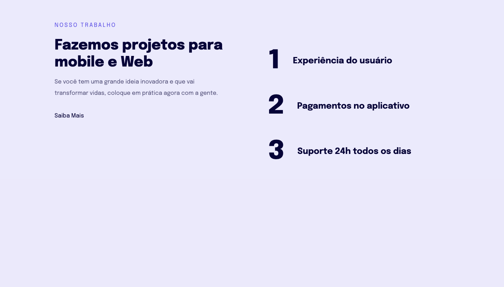

<h1 align="center"> Treinando Responsividade </h1>

  <a href="#-tecnologias">Tecnologias</a>&nbsp;&nbsp;&nbsp;|&nbsp;&nbsp;&nbsp;
  <a href="#-projeto">Projeto</a>&nbsp;&nbsp;&nbsp;|&nbsp;&nbsp;&nbsp;
  <a href="#-layout">Layout</a>&nbsp;&nbsp;&nbsp;|&nbsp;&nbsp;&nbsp;

 

## 🚀 Tecnologias

Esse projeto foi desenvolvido com as seguintes tecnologias:

- HTML e CSS
- Git e Github
- Figma

## 💻 Projeto

-Projeto De Treino sobre o estudo de sites responsivos

- [Acesse o projeto finalizado, online](https://laroyprado.github.io/treinando-responsividade/)

## 🔖 Layout

Você pode visualizar o layout do projeto através [DESSE LINK](https://www.figma.com/file/XJjFITQ4aXvsAD2UsemrgY/Explorer-Stage-03-Projeto-02-(Copy)?node-id=203-1798&t=LTFOuZUJLSUGP7bs-0). É necessário ter conta no [Figma](https://figma.com) para acessá-lo.

## :memo: Licença

Esse projeto está sob a licença MIT.

---

